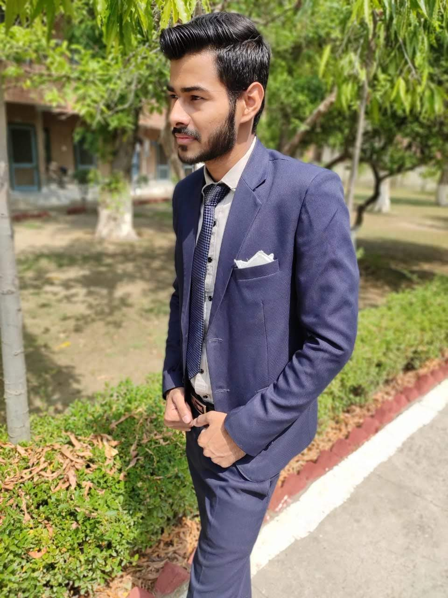

About Myself

My name is krishan kumar. I'm pursuing B.tech in computer science from DCRUST MURTHAL SONIPAT. 
I'm in 4th year now.

My Skills :- I'm a FullStack Web Developer. I learned full stack web development from CODING BLOCKS(ONLINE). It was 4 months course in which i learned about HTML,CSS,JavaScript,Bootstrap,jquery,Node.js,epress.js,mongodb,mongose,ejs,RestApi,passport js,Authentication & hashing.

currently I'm learning React.
 
My Hobbies :-

1) Running
2) Watching movies & webs series
3) Website designing
4) Gyming
5) Music